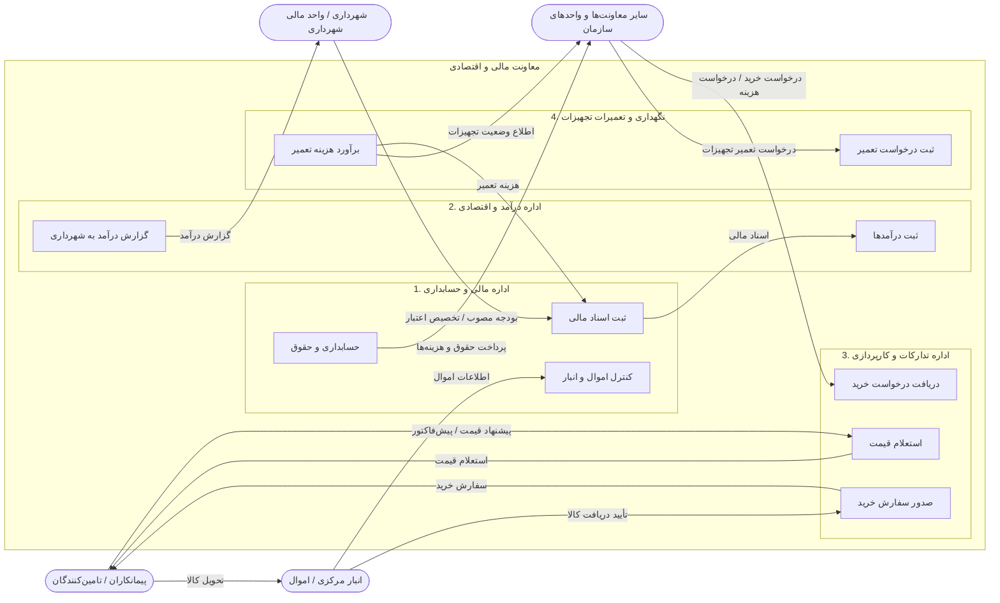
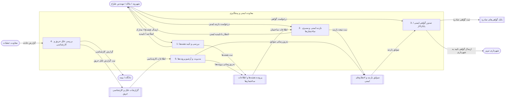
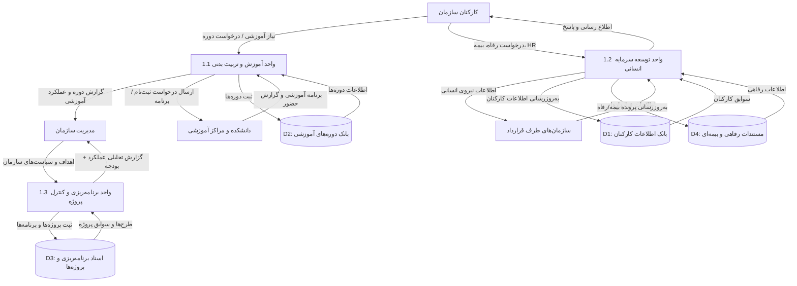
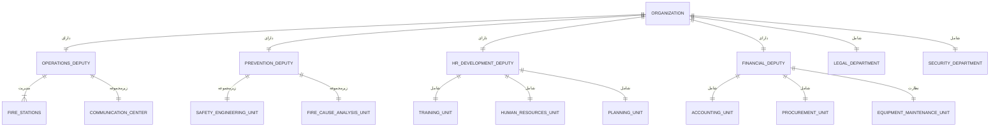

# system analysis and design

## DFD LEVEL 0

---
---

## DFD LEVEL 1

---
---

## DFD Level 1 معاونت امور مالی

---
---

## DFD Level 1 معاونت عملیات

---
---

## DFD Level 1 معاونت ایمنی و پیشگیری

---
---

## DFD Level 1 معاونت برنامه ریزی و توسعه سرمایه انسانی

---
---

## ER DIAGRAM

---
---

