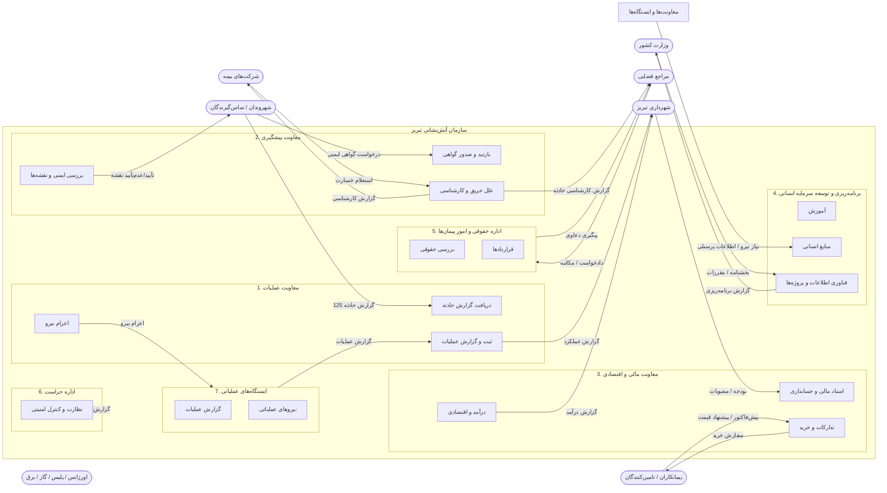

# system-analysis-and-design

## DFD LEVEL 0

```mermaid
flowchart LR
    %% External Entities
    Citizen([شهروندان / تماس‌گیرندگان])
    Municipality([شهرداری تبریز])
    Court([مراجع قضایی])
    Contractors([پیمانکاران و شرکتهای تجهیزات])
    Services([سازمان‌های خدمات شهری<br>اورژانس، پلیس، گاز، برق])
    Ministry([وزارت کشور])

    %% Main Process
    FireDept((سازمان آتش‌نشانی تبریز))

    %% Data Flows
    Citizen -->|گزارش حادثه / درخواست ایمنی| FireDept
    FireDept -->|اعزام نیرو، پاسخ‌دهی، نتیجه عملیات| Citizen

    Municipality -->|بودجه، مصوبات، ابلاغیه‌ها| FireDept
    FireDept -->|گزارش عملکرد / گزارش آماری| Municipality

    Court -->|استعلام علت حادثه| FireDept
    FireDept -->|گزارش کارشناسی علل حریق| Court

    Contractors -->|تجهیزات / قراردادها| FireDept
    FireDept -->|درخواست خرید، اسناد قرارداد| Contractors

    Services -->|هماهنگی عملیاتی| FireDept
    FireDept -->|اطلاع‌رسانی و درخواست پشتیبانی| Services

    Ministry -->|بخشنامه‌ها / مقررات ملی| FireDept
    FireDept -->|آمار و گزارش کشوری| Ministry
```
---
---

## DFD LEVEL 1

```mermaid
flowchart LR

    %% External Entities
    Citizen([شهروندان / تماس‌گیرندگان])
    Municipality([شهرداری تبریز])
    Court([مراجع قضایی])
    Suppliers([پیمانکاران / تامین‌کنندگان])
    Services([اورژانس / پلیس / گاز / برق])
    Ministry([وزارت کشور])
    Insurance([شرکت‌های بیمه])

    %% Main Organization Process
    subgraph FireDept[سازمان آتش‌نشانی تبریز]

        %% معاونت عملیات
        subgraph Op[1. معاونت عملیات]
            OpA[دریافت گزارش حادثه]
            OpB[اعزام نیرو]
            OpC[ثبت و گزارش عملیات]
        end

        %% معاونت پیشگیری
        subgraph Prev[2. معاونت پیشگیری]
            PrevA[بررسی ایمنی و نقشه‌ها]
            PrevB[بازدید و صدور گواهی]
            PrevC[علل حریق و کارشناسی]
        end

        %% معاونت مالی
        subgraph Fin[3. معاونت مالی و اقتصادی]
            FinA[اسناد مالی و حسابداری]
            FinB[تدارکات و خرید]
            FinC[درآمد و اقتصادی]
        end

        %% معاونت برنامه‌ریزی و منابع انسانی
        subgraph HR[4. برنامه‌ریزی و توسعه سرمایه انسانی]
            HR1[آموزش]
            HR2[منابع انسانی]
            HR3[فناوری اطلاعات و پروژه‌ها]
        end

        %% اداره حقوقی
        subgraph Legal[5. اداره حقوقی و امور پیمان‌ها]
            L1[بررسی حقوقی]
            L2[قراردادها]
        end

        %% حراست
        subgraph Sec[6. اداره حراست]
            S1[نظارت و کنترل امنیتی]
        end

        %% ایستگاه‌ها
        subgraph Stations[7. ایستگاه‌های عملیاتی]
            ST1[گزارش عملیات]
            ST2[نیروهای عملیاتی]
        end

    end


    %% ==== DATA FLOWS ====

    Citizen -->|گزارش حادثه 125| OpA
    OpB -->|اعزام نیرو| Stations
    Stations -->|گزارش عملیات| OpC
    OpC -->|گزارش عملکرد| Municipality

    PrevA -->|تأیید/عدم‌تأیید نقشه| Citizen
    Citizen -->|درخواست گواهی ایمنی| PrevB
    PrevC -->|گزارش کارشناسی حادثه| Court

    Municipality -->|بودجه / مصوبات| FinA
    FinC -->|گزارش درآمد| Municipality

    Suppliers -->|پیش‌فاکتور / پیشنهاد قیمت| FinB
    FinB -->|سفارش خرید| Suppliers

    Insurance -->|استعلام خسارت| PrevC
    PrevC -->|گزارش کارشناسی| Insurance

    Ministry -->|بخشنامه / مقررات| HR3
    HR3 -->|گزارش برنامه‌ریزی| Ministry

    UnitsA[معاونت‌ها و ایستگاه‌ها] -->|نیاز نیرو / اطلاعات پرسنلی| HR2

    Legal -->|پیگیری دعاوی| Court
    Court -->|دادخواست / مکاتبه| Legal

    S1 -->|گزارش نظارتی| FireDept
```
---
---

##DFD Level 1 معاونت امور مالی

```mermaid
flowchart LR

    %% External Entities
    Municipality([شهرداری / واحد مالی شهرداری])
    Suppliers([پیمانکاران / تامین‌کنندگان])
    Units([سایر معاونت‌ها و واحدهای سازمان])
    Warehouse([انبار مرکزی / اموال])

    %% Main Process
    subgraph FinanceDept[معاونت مالی و اقتصادی]
        
        subgraph A1[1. اداره مالی و حسابداری]
            A1a[ثبت اسناد مالی]
            A1b[حسابداری و حقوق]
            A1c[کنترل اموال و انبار]
        end

        subgraph A2[2. اداره درآمد و اقتصادی]
            A2a[ثبت درآمدها]
            A2b[گزارش درآمد به شهرداری]
        end

        subgraph A3[3. اداره تدارکات و کارپردازی]
            A3a[دریافت درخواست خرید]
            A3b[استعلام قیمت]
            A3c[صدور سفارش خرید]
        end

        subgraph A4[4. نگهداری و تعمیرات تجهیزات]
            A4a[ثبت درخواست تعمیر]
            A4b[برآورد هزینه تعمیر]
        end

    end

    %% Data Flows

    Units -->|درخواست خرید / درخواست هزینه| A3a
    Units -->|درخواست تعمیر تجهیزات| A4a

    A3b -->|استعلام قیمت| Suppliers
    Suppliers -->|پیشنهاد قیمت / پیش‌فاکتور| A3b

    A3c -->|سفارش خرید| Suppliers
    Suppliers -->|تحویل کالا| Warehouse

    Warehouse -->|تأیید دریافت کالا| A3c
    Warehouse -->|اطلاعات اموال| A1c

    Municipality -->|بودجه مصوب / تخصیص اعتبار| A1a
    A2b -->|گزارش درآمد| Municipality

    A1a -->|اسناد مالی| A2a
    A1b -->|پرداخت حقوق و هزینه‌ها| Units

    A4b -->|هزینه تعمیر| A1a
    A4b -->|اطلاع وضعیت تجهیزات| Units
```
---
---
